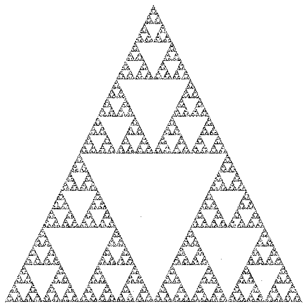

# Sierpinski Triangle Generator

I saw [this](https://vm.tiktok.com/ZTduEtrWe/) video on TikTok of all places and decided to make a little generator in Rust.



## Generating An Image

To generate an image run

``` sh
cargo run -- -n <number_of_iterations> > out.ppm
```

## Generating a Video

To generate a video, I use `ffmpeg`

``` sh
cargo run -- -n <number_of_iterations> --video \
  | ffmpeg -y -r 60 -f image2pipe -vcodec ppm -i - output.mp4
```
